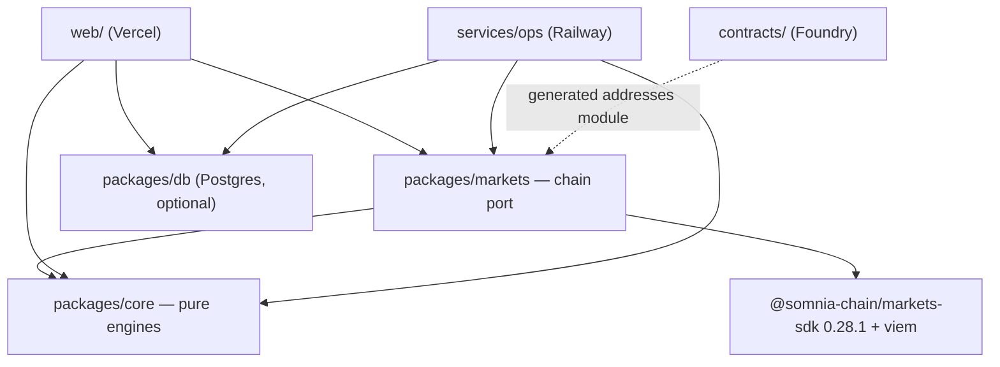
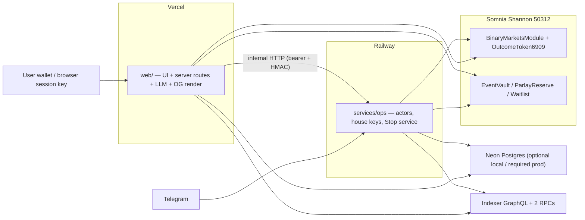

# Architecture Spine — Masayume

> **SUPERSEDED AS A COMPLETE ARCHITECTURE.** Retain only the engineering invariants explicitly adopted by `docs/architecture/yosuku-source-led-migration/02-target-architecture.md`. Its UI contract, scope, global signing model, and capability map are not current authority.

## Design Paradigm

**Hexagonal (ports & adapters) around one chain port.** Pure domain engines in the core; exactly one adapter owns all chain access — imports *and I/O* (AD-14); UI, server routes, and ops actors are peers plugged into the same port. Long-running money-movers are **single-writer actors** — one key, one process, one journal each. There is no server bet-placement API: user orders are client-signed through the Submitter running in the browser; house orders run the same Submitter inside ops actors.

Layer → directory map:

| Layer | Lives in | May import |
| --- | --- | --- |
| Core (pure engines + domain types) | `packages/core` | zod only |
| Chain port (the ONE adapter) | `packages/markets` | core, `@somnia-chain/markets-sdk`, viem |
| Web (UI + server routes) | `web/` | core, markets, db, wagmi/RainbowKit (wallet session only — AD-14) |
| Ops (actor services) | `services/ops` | core, markets, db |
| Contracts | `contracts/` | — (Foundry; addresses exported upward) |
| DB schema/client | `packages/db` | zod, drizzle |



Dependency rule: arrows only as drawn. `core` imports nothing above it; nothing except `packages/markets` imports the SDK or raw ABIs — and nothing outside it performs chain I/O (AD-14).

## Invariants & Rules

### AD-1 — One chain port `[ADOPTED]`

- **Binds:** all
- **Prevents:** parallel chain-access paths; SDK types bleeding into UI/engines; two scan/fold implementations of one chain truth disagreeing on screen.
- **Rule:** only `packages/markets` imports `@somnia-chain/markets-sdk` or contract ABIs. It exposes `MarketsProvider` (reads/watches) and `Submitter` (writes). Domain types (`EventMarket`, `Quote`, `OpenPosition`, `ClosedTrade`, `LedgerRow`) are declared in `packages/core`; the adapter maps SDK→domain at the boundary. **History feed:** `MarketsProvider.getLedger(wallet)` is the *only* history feed — complete, deduplicated, oldest-first; the adapter owns canon #10/#17 scoping internally and reassembles the full ledger. **The ledger merges two event sources:** wallet-held ERC-6909 activity AND EventVault events attributed to that wallet as beneficiary (every STRATEGY/EXECUTOR/SESSION trade) — a wallet-only ledger is a defect (delegated trades must appear in portfolio, Edge, CSV, Banzuke, and `/stats`). `core/claims` likewise enumerates both wallet redeemables and crankable/withdrawable Vault credits, rendered as distinct labeled rows (a Vault credit is a withdrawal, not a redeem). All window filtering happens inside the `core/pnl` fold (close-time filter, prior mints as cost basis, loss synthesis); portfolio, Edge, Banzuke, and `/stats` consume the same fold output. **Lifecycle:** `core/lifecycle` derives the market phase enum (`upcoming | pendingOpeningPrint | trading | noEntryBuffer | locked | settledUnclaimed | finalized | voided`) in one function from market row + clock; `MarketsProvider.nextWindow(market)` resolves successors (Ticket auto-advance, dead-deep-link routing law).

### AD-2 — Integer numbers

- **Binds:** all money, price, and probability paths
- **Prevents:** float drift; the 6dp/18dp decimals landmine; preview-vs-contract disagreement on the surface that promises "payout already locked."
- **Rule:** amounts are `bigint` base units end-to-end; token decimals are read from chain once at adapter init and live only in `packages/core/units`; formatting happens only at render. **Probabilities and prices cross every module boundary as integers** — venue price-grid units where a book is involved, bps elsewhere (combined prob, λ floor, margin). IEEE floats exist only inside `core/fair-value` internals and never serialize. Float arithmetic on money or serialized probabilities is a defect.

### AD-3 — One write pipeline, two lanes `[ADOPTED]`

- **Binds:** every chain write, from every surface
- **Prevents:** canon violations scattered per call-site; a second tx-build path in web (deposits bypassing the error map); double-execution on retry; booking requested size instead of fills.
- **Rule:** the `Submitter` has two lanes. `submitOrder(…)`: the full order pipeline — on-chain `status === 1` gate → **Daily-Stop gate (AD-9, named mandatory pre-send step)** → fresh quote → IOC with `expireTimestampNs` from the headroom formula → send → `assertTxOk` → book from receipt fills. `submitTx(…)`: journal intent → simulate → send → `assertTxOk` → error-map (AD-13) → book from receipt — for every non-order write: approve, faucet mint, vault deposit/withdraw/grant create/revoke/pause, parlay open/claim, waitlist join, redeems. **No `writeContract`/`sendTransaction` call exists outside `packages/markets`** (CI grep invariant). Intent is journaled before send; a response carrying a digest counts as submitted; a send that times out with *no* digest is never auto-retried — the pipeline reconciles via nonce/open-order scan before permitting resubmit. **Order routing has a third dimension — direct-wallet vs vault-delegated:** a delegated order (STRATEGY/EXECUTOR/SESSION) is a call into EventVault that places the venue order in-contract — different ABI, fills parsed from EventVault events (not venue receipts), canon rules enforced through the contract hop; the `submitOrder` lane expresses both routes behind one interface, and neither route is implemented twice. The venue's treatment of contract-originated orders — including self-match behavior between two subscribers of the same vault — is an explicit build-phase verification (Story 6.1) before any vault order ships. The 17-rule canon (PRD addendum §D) binds here and is nowhere re-implemented; its read-side rules (#10 Finalized discovery, #15 fee-from-chain, #17 window-scoped fills) bind `MarketsProvider` internals the same way.

### AD-4 — Wallet-per-role registry

- **Binds:** ops actors, seed scripts, demo setup
- **Prevents:** self-match dead demos (pool refuses self-matches); nonce racing; one leaked key spending every power.
- **Rule:** a checked-in role registry maps each economic role — `maker`, `runner-oracle-follow`, `relayer`, `executor`, `faucet-ops`, `deployer`, `demo-user` — to a distinct key. One writer per key. House keys exist only in the ops service environment, never in web.

### AD-5 — Unified grants: EventVault is the only delegation framework

- **Binds:** FR-4, FR-28…FR-32, FR-36…FR-37
- **Prevents:** three custody mechanisms with three trust stories; the Strategy/Executor grant collision; tap-bets reverting under a UI that shows funds.
- **Rule:** every delegated power is an EventVault grant with a type — `STRATEGY | EXECUTOR | SESSION` — each with independent Caps, expiry, and one-call revocation; beneficiary is hard-wired to the depositor in all three. Session-key tap-trading (FR-4) = a `SESSION` grant to a browser-held ephemeral viem key (IndexedDB). No EIP-7702 dependency (unverified on testnet 50312); no venue operator-registry dependency (spot-only risk). Resolves PRD OQ-5.
  **SESSION funding surface:** SESSION bets spend **Vault balance** by construction. Therefore: (a) the enable flow composes deposit + grant into one action — no orphaned zero-balance grant; (b) while session mode is armed, tickets and quick-chips size against Vault balance and label the source ("betting from your Vault" — FR-5's labeled-pools rule); (c) a tap exceeding Vault balance falls back to a normal wallet prompt; (d) session bets are user bets — the Daily Stop applies (AD-9) and they count toward no Strategy's Caps.
  **Cap clock:** `maxDailySpend` buckets by **UTC day** (`block.timestamp / 86400`). Delegates pre-check headroom only via one shared `core/caps.simulate()` mirroring the contract op-for-op, golden-cross-tested against forge vectors. Copy rule: cap resets say "00:00 UTC"; the Daily Stop says "midnight your time"; never merged in UI or bot text.

### AD-6 — Staleness is a type

- **Binds:** every read surfaced to UI
- **Prevents:** null→0 lies; ad-hoc "last known good" caches; two envelope shapes at one boundary.
- **Rule:** reads cross the port as `Reading<T> = { ok: true, value, asOf, stale } | { ok: false, error }` (pinned in `core/schemas`): first-ever failure is the error arm; a failed *refresh* keeps `ok: true` and flips `stale`. Client state = RSC shells + client islands on TanStack Query v5, fed watch-first from adapter subscriptions with visibility-gated polling as fallback. No component invents its own fetch loop. **Quote latency budget (NFR-5):** the quote path is client → adapter → indexer/RPC direct — no server hop; p95 ≤ 1.5s is asserted by a perf smoke in the integration harness.

### AD-7 — One optional Postgres; chain truth never stored

- **Binds:** takes, TG links, Baku memory, Daily Stop, runner heartbeats
- **Prevents:** a second source of truth for money; a hard DB dependency breaking the zero-env judge quickstart; unspecified degradations shipping lies.
- **Rule:** one Postgres (Neon, via Drizzle in `packages/db`) holds only social/copilot/ops data; chain truth is recomputed from chain/indexer. **Zero-env law, scoped:** local/judge runs work with no DB; the *production* deployment requires the store (a DB-less prod deploy is non-compliant — FR-24/§12 need it). **The degradation table is exhaustive over the schema** — a table without a degradation row is a defect: `takes` → empty feed · `baku_memory` → memory-less Reads · `daily_stops` → client-local Stop with honest scope label · `tg_links` → linking refused with an honest bot reply, rail visibly disabled · `runner_heartbeats` → health served live from ops over the internal HTTP (the DB row is durability, not the source); ops unreachable → "status unknown — ops offline," never "alive," never blank · `llm_budgets` (web-written) → Baku model-numbers-only · `sponsor_gates` (ops-written; device-hash + wallet, per-endpoint counters) → every sponsored endpoint refuses honestly. **Cost/abuse controls degrade closed:** LLM chat and every endpoint *we sponsor* (relayer, waitlist sponsor, any future STT drip) require their store; without it they refuse — "not available in this deployment." **The tUSDC faucet is NOT one of them:** the mint is a client-signed call to the venue's own token contract — ungated by us, zero-env-safe; the venue's per-call cap is the real limit. Our per-device/per-account gates bind only what our keys pay for. Resolves PRD OQ-7.

### AD-8 — Single ops service of single-writer actors

- **Binds:** seeder/maker, oracle-follow runner, relayer, TG executor, settlement watcher/claim sweeper, Stop service
- **Prevents:** nonce racing on serverless; keeper liveness becoming custody; key sprawl.
- **Rule:** all house-key writers run inside one long-running ops service as isolated actors — own key, own loop, own local intent journal, why-string every cycle (idle = heartbeat). The **settlement watcher** actor observes finalizations and emits settlement events; the TG executor consumes them for Verdict postbacks. Web calls ops via the authed internal HTTP (AD-16); web never signs with house keys. Every keeper step keeps a permissionless fallback (NFR-6). A watchdog inside ops alerts the admin Telegram channel when any actor's heartbeat stalls past its FR-32 threshold.

### AD-9 — The Daily Stop: one service, closed entry-point set

- **Binds:** FR-24; every betting surface
- **Prevents:** the tilt-prone surface escaping the Stop; two stop ledgers with two semantics; check-then-act races.
- **Rule:** betting entry points are enumerated and closed: (1) web wallet ticket, (2) Reels inline ticket, (3) Baku act-on-it card, (4) session-key tap bets, (5) TG executor. The Stop gate is a named mandatory pre-send step of AD-3's order lane, so every entry point inherits it by construction. Authority tiers, stated honestly: server-keyed path (5) hard-refuses; client-keyed paths (1–4) call the same check endpoint pre-send and refuse in the pipeline — app-layer enforcement over our own surfaces (an adversary bypassing our client is out of scope; our surfaces diverging is not). Strategy-Runner trades are Stop-exempt (Caps govern). **One writer:** the Stop service lives in ops (executor calls in-process; web via `POST /api/stop/check`, which requires the SIWE session wallet to equal the target wallet — nobody burns another wallet's headroom); its only mutation path is **reserve-then-reconcile**: `checkAndReserve(wallet, costBaseUnits)` reserves the requested cost pre-send as one atomic statement (`UPDATE … SET spent = spent + $cost WHERE wallet = $w AND spent + $cost <= "limit"` — zero rows = refused), and after the order lands the pipeline reconciles the reservation to the actual booked cost from fills — releasing the difference on a partial fill and the whole reservation on a revert/miss. `spent` is never decremented *by user action*, only reconciled to booked reality (spend-as-loss-bound; UI label "total staked today"); read-then-write is a defect. A stop-check that errors or times out while a stop may exist **fails closed** — the bet blocks with "can't verify your Daily Stop," never fail-open. **Reset:** schema `(wallet, limit, spent, tz, resetAt)` stores an IANA timezone **auto-captured from the browser at the wallet's first SIWE session** (UTC only until any session exists) and updatable in the Stop settings surface; midnight computed server-side from that column, never from the caller's locale. The term "web ticket API" does not exist; the server surface is `POST /api/stop/check` (web) and the in-process Stop service (ops).

### AD-10 — Contracts export one address module; market identity on-chain

- **Binds:** contracts/, packages/markets
- **Prevents:** address drift; the recycled-pool landmine re-armed inside our own contracts.
- **Rule:** Foundry deploys write a generated addresses module consumed only by `packages/markets`; deploy order is lockstep — deploy contracts → commit regenerated addresses module → deploy ops + web from that commit. Contracts store and emit **only the venue's canonical on-chain market identifier** (the id `BinaryMarketsModule`/`OutcomeToken6909` keys markets by — pin the exact field in build phase 1's verification; candidate: the id underlying `yesId`/`noId`). Pool/book addresses may be passed as call arguments where an in-tx read requires them, but never persisted in storage or emitted in events; `packages/markets` owns the on-chain-id ↔ branded-`MarketId` bijection (forge test `test_AD10_no_pool_address_in_storage`; event-ABI check in CI invariants). The no-divert property (FR-30) and the parlay payout-escrow invariant (FR-34) are named forge tests; ParlayReserve reads leg prices from the on-chain book inside the opening tx.

### AD-11 — Attribution hook in the Submitter

- **Binds:** FR-9, all order flow
- **Prevents:** retrofitting builder-fee tagging across call sites.
- **Rule:** `Submitter` carries an order-attribution hook (builder tag), no-op in v1. Resolves PRD OQ-3's design half.

### AD-12 — shadcn/ui primitives, DESIGN.md skin, two named token surfaces

- **Binds:** web UI
- **Prevents:** two component kits; token forks between CSS and components; the component-tier tokens becoming builder-invented.
- **Rule:** shadcn/ui (Radix) supplies interaction primitives. DESIGN.md tokens land in exactly two named surfaces, both in `web/src/styles/`: **primitives** (colors, spacing, radius, type scale) as Tailwind v4 `@theme` declarations in `theme.css`; **component-tier tokens** (cta-height, reel max-width, stamp rotation, per-component mappings) as CSS custom properties in `tokens.css`, section-per-component mirroring DESIGN.md's `components:` frontmatter. No raw hex/px literal from DESIGN.md appears in component code (CI grep). Product surfaces (Ticket, Reel card, Receipt, plates, stamps) are hand-built on the primitives. No second kit.

### AD-13 — One error map

- **Binds:** all user-facing failures
- **Prevents:** raw provider errors reaching users (the out-of-STT "invalid parameters" trap); per-surface error copy drift.
- **Rule:** one error-map module in `packages/markets` translates provider/SDK failures into typed diagnoses; UI copy lives with EXPERIENCE.md's voice table. Ops actors log the typed diagnosis, not the raw string. Both Submitter lanes (AD-3) route through it by construction.

### AD-14 — Chain truth is bounded by I/O, not imports

- **Binds:** all
- **Prevents:** hand-written GraphQL beside the port; wagmi read-hooks creating a second balance on one screen; `/stats` disagreeing with the Banzuke.
- **Rule:** no code outside `packages/markets` opens a connection to chain RPCs, the indexer GraphQL endpoint, Multicall3, or the oracle-explorer API. FR-22's named queries are surfaced as *data*: `MarketsProvider` returns each stat with its provenance query string; the page renders GraphQL, never executes it. wagmi/RainbowKit are scoped to wallet session only (connect, chain add/switch, `walletClient` handoff to the Submitter); `useBalance` / `useReadContract` / `usePublicClient` are banned in product code (CI grep). Every chain read reaching web is an AD-6 `Reading<T>` from the adapter.

### AD-15 — The claim protocol

- **Binds:** FR-3, FR-11; claim-all plate (web) ↔ relayer (ops)
- **Prevents:** plate/relayer authority forks; "claimed" over a stranded void side; displayed ≠ paid on a fee flip.
- **Rule:** the relayer is the sole execution authority for sponsored claims. The plate submits per-item claim intents `{marketId, outcomeIdx, minPayoutBaseUnits, redeemAuth}` — the EIP-712 digest binds all fields. The relayer re-validates each intent against its own chain read before spending gas (§12 adversarial rule), executes per-item, idempotent, journaled, and returns per-item results; the plate renders per-item outcomes, never one collapsed verdict. Voids are two intents, linked by the plate, rendered as one row with two states. The claimable enumeration and net-of-fee sum come from one core function (`core/claims`) called by both plate (display) and relayer (validation); `settlementFeeBps` is read at execution time, never cached at init. Sponsorship policy: per-function allowlist validated over the whole batch (one unlisted call rejects the batch); every sponsored/drip endpoint (relayer, faucet gates, waitlist) carries per-device + per-account gates, store-backed, degrading closed (AD-7).

### AD-16 — Identity & internal auth

- **Binds:** every wallet-keyed server write (takes, Baku memory, Stop config, TG link start); web ↔ ops
- **Prevents:** four epics inventing four auth schemes; anyone writing another wallet's Stop; a decorative "server-authoritative."
- **Rule:** web verifies wallet control via **SIWE**: sign-in message → httpOnly session cookie; every wallet-keyed write requires session wallet = target wallet. Telegram identity binds via the FR-36 signed link proof (wallet signature over the TG id + nonce), stored in `tg_links`; the executor acts only for linked, receipted identities. Web ↔ ops internal HTTP is authenticated with a shared secret bearer token + HMAC body signature; ops endpoints are not publicly routable. LLM keys and house keys never leave their service's env.

## Consistency Conventions

| Concern | Convention |
| --- | --- |
| Naming | `marketId` is the identity everywhere off-chain (branded `MarketId`); on-chain identity per AD-10; never pool address. Grant types `STRATEGY/EXECUTOR/SESSION`. FR/AD ids cited in story ACs and test names (`test_AD5_no_divert…`). |
| Time | Three domains, converted only at `packages/markets`: **ms** off-chain, **ns** only inside `Submitter`, **seconds** on-chain. Every time-valued field and ABI parameter carries its suffix (`settledAtMs`, `expirySec`, `expireTimestampNs`) — including Solidity names (CI grep: no unsuffixed time-shaped name in shared types or ABIs). Claim time ≠ oracle print time (`settledAtMs` / `expiryMs`). Absolute UTC on anything screenshotable. |
| Data & formats | zod schemas at every boundary (`core/schemas`); reads as `Reading<T>` (AD-6); DB rows never store bigint as float — text columns. Money figures derive from state reads or complete logs, never pruned/row-capped scans (NFR-4); lossy sources drive counts only. |
| Parlay math | One fixed-point algorithm: `core/parlay-math` mirrors ParlayReserve op-for-op; a checked-in golden-vector file is asserted byte-identical by vitest and forge; rounding direction specified per operation in the vectors — "favors the Reserve" is a test assertion, not a comment. |
| DB ownership | Every table names its single writing service in the schema file: `takes` → web · `baku_memory` → web · `llm_budgets` → web · `daily_stops` → Stop service (ops) · `tg_links` → ops · `sponsor_gates` → ops · `runner_heartbeats` → ops. All other services read-only per table; a second writer is a defect. |
| Approvals | Every first interaction with a new ERC-20 spender (venue module, EventVault, ParlayReserve) absorbs its approval into that action's confirm step with the same one honest sentence — never a surprise mid-flow signature; a later action whose cost exceeds the remaining allowance absorbs the re-approval the same way, pre-checked before send. |
| URLs | One `core/urls` module builds every deep link, Receipt link, explorer/oracle-graph URL — consumed by web routes, share cards, OG images, and the TG executor alike. |
| State & cross-cutting | Config via one zod-parsed `env.ts` per deployable with baked testnet defaults (zero-env law, AD-7 scope); logging = structured why-strings; no global mutable state in core; LLM key server-side only. |
| Testing | Core: vitest golden tests (FIFO incl. loss-synthesis, parlay vectors, sizing, caps.simulate). Contracts: forge invariant-named tests + shared golden vectors. Ops: dry gate → wet gate vs distinct counterparty wallet → open-order delta leak check; quote-path p95 perf smoke. CI: network-free invariants script (status enum, taker-IOC, headroom, address/SDK drift, the AD-3/AD-14 grep rules, event-ABI pool-address check). |
| Ops envelope | Neon automated backups (PITR) as-is; accepted loss on social/ops tables is a restore-to-default (stated risk). Deploy lockstep per AD-10. Railway note: trial credit covers the judging window; keep-alive after 8 Sep needs the paid hobby tier. Actor-stall alerting per AD-8 watchdog. |

## Stack

| Name | Version |
| --- | --- |
| Next.js / React | 16.3.4 / 19.2.8 (repo; both npm latest, mutually compatible) |
| Tailwind CSS | v4 (`@theme` + `tokens.css` per AD-12) |
| @somnia-chain/markets-sdk | **0.28.1 exact** (npm latest 2026-08-21; 9 releases in 17 days justify the exact pin) |
| viem / wagmi / RainbowKit | wagmi **v2 line — pinned by RainbowKit 2.2.x peer req** (`^2.9.0`; wagmi v3 unsupported there yet). Residual risk noted: wagmi 2.x frozen since 2025-11; fallback is wagmi v3 + another connect kit. |
| TanStack Query | v5 (current; no v6 exists) |
| Vercel AI SDK (`ai`) + AI Gateway | **v7** (current major; Gateway docs for `anthropic/claude-opus-5` — verified live — target v7). Model string env-swappable. |
| Drizzle ORM + Neon Postgres | drizzle-orm **≥ 0.40.1** (neon-http fix) + `@neondatabase/serverless` 1.1.x |
| grammY (Telegram) | 1.46.x (long-polling, single process) |
| Foundry | stable v1.8.x |
| pnpm workspaces | current |
| Chain | Somnia Shannon testnet 50312; tUSDC collateral; STT gas |

## Structural Seed

```text
sommina-events/
  web/                  # Next.js app (Vercel)
    app/                #  /markets /reels /portfolio(/edge) /parlays /vaults /leaderboard
                        #  / /stats /waitlist /demo /pitch (no live-data imports — never breaks during judging)
                        #  /dev/* fixtures + /dev/doctor (calls ops health; NFR-8)
                        #  api: stop/check, takes, baku (LLM), og + share-card render, stats provenance
  packages/core/        # pure engines: units, sizing, pnl/fifo, leaderboard, parlay-math, caps.simulate,
                        #  fair-value, lifecycle, claims, urls, schemas (Reading<T>), domain types
  packages/markets/     # THE chain port: MarketsProvider (incl. getLedger, nextWindow, stats+provenance),
                        #  Submitter (submitOrder/submitTx lanes, Stop gate, attribution hook), error map,
                        #  addresses (generated), rpc failover
  packages/db/          # drizzle schema + client (optional at runtime; single-writer per table)
  services/ops/         # actors: seeder-maker, runner-oracle-follow, relayer, tg-executor (grammY),
                        #  settlement-watcher/claim-sweeper, stop-service, watchdog; local intent journals
  contracts/            # Foundry: EventVault (typed grants), ParlayReserve, Waitlist; deploy -> addresses module
  context/ reference/   # research knowledge base (read-only)
```



Core DB entities (social/ops only, per AD-7; single writer per the DB-ownership convention): `takes` · `tg_links` · `baku_memory` · `daily_stops (wallet, limit, spent, tz, resetAt)` · `runner_heartbeats` · `llm_budgets (wallet, day, spent)` · `sponsor_gates (endpoint, deviceHash, wallet, counters)`.

## Capability → Architecture Map

| Capability / Area | Lives in | Governed by |
| --- | --- | --- |
| Onboarding & wallet (FR-1…5) | web + markets | AD-1, AD-2, AD-6, AD-13, AD-14 |
| Markets loop (FR-6…11) | web + markets | AD-1, AD-3, AD-6, AD-15 (claims) |
| Reels + Takes (FR-12…15) | web (+db takes) | AD-6, AD-7, AD-16; backing orders via AD-3 |
| Portfolio/Edge/Close-early (FR-16…20, FR-40) | core engines + web | AD-1 (getLedger), AD-2, AD-6 |
| Provably-fair (FR-21…22) | web + markets | AD-14 (provenance-as-data), AD-6 |
| Baku (FR-23…25) | web server routes + core model | AD-7, AD-6, AD-16; LLM server-side |
| Leaderboard (FR-26…27) | core engine + web | AD-1 (getLedger), AD-2; house registry AD-4 |
| Vault strategies (FR-28…32) | contracts + ops + web | AD-5, AD-8, AD-10 |
| Parlays (FR-33…35) | contracts + web | AD-10, AD-2, parlay-math convention |
| Telegram rail (FR-36…37) | ops (executor + settlement watcher) | AD-5 (EXECUTOR), AD-8, AD-9, AD-16 |
| Session keys (FR-4) | contracts + web | AD-5 (SESSION), AD-9 |
| Growth/landing (FR-38…39) | web + contracts (Waitlist) | AD-10, AD-15 (sponsorship gates) |
| Daily Stop (FR-24) | ops Stop service + web check + db | AD-9, AD-16 |
| Judge ring: /demo /pitch /dev/* doctor (NFR-8) | web + ops health | AD-7 (fixtures need no DB), AD-12; /pitch imports no live data |
| Share cards / OG images (FR-15) | web server routes | AD-14 (reads via port), urls convention |
| Seed liquidity / demo ops | ops | AD-4, AD-8 |

## Deferred

- **Exact Cap/risk-cap values** (parlay floors, exposure bps, Brake thresholds) — numbers bank (PRD addendum §F) owns defaults; tuned during contract/build work.
- **Streams/reactivity adoption depth** — AD-6's subscription seam absorbs it; push vs poll per surface decided in build against real testnet behavior.
- **OQ-10 reference-anomaly response** — empirical; the model reads its settlement-basis price through the port, so the fix lands in one place. Verify in build phase 1 (with AD-10's on-chain-id field pin).
- **OQ-9 MCP server / agent API — resolved (Abu, 2026-09-01: ADD)** — now FR-41 / Story 9.6; it is one more consumer of `packages/markets` and nothing else changes (no new AD needed — that was the point of AD-1).
- **Indexer-vs-logs choice per read** — adapter-internal (AD-1/AD-14 make it invisible to consumers).
- **PWA installability details, CSV column list** — code-level; FR-19's TradeRow shape is already pinned by the PRD.
- **Mainnet path** (USDso 18dp, SOMI gas, venue ids) — AD-2's chain-derived decimals and AD-10's address module carry it; not a v1 concern.
